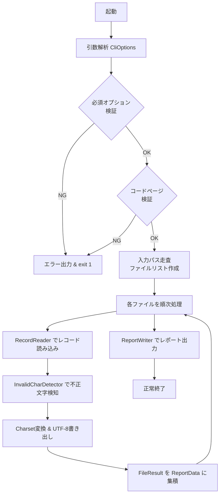

# アーキテクチャ設計書 — E2UConverter

## 1. システム概要

E2UConverter は、z/OS 上の EBCDIC ソースファイルを UTF-8 に変換する CLI ツールである。  
Java で実装し、Maven により fat JAR としてビルドして Windows PC 上で動作させる。

---

## 2. パッケージ構成

```
com.example.e2uconverter
├── Main.java                    # エントリーポイント
├── cli/
│   └── CliOptions.java          # コマンドラインオプション解析・保持
├── converter/
│   ├── FileConverter.java       # 単一ファイル変換処理
│   ├── FixedRecordReader.java   # 固定長レコードモード読み込み
│   ├── StreamRecordReader.java  # バイトストリームモード読み込み
│   └── RecordReader.java        # RecordReader インターフェース
├── validator/
│   └── InvalidCharDetector.java # 不正文字検知ロジック
├── report/
│   ├── ReportData.java          # レポートデータ保持（統計・詳細）
│   ├── FileResult.java          # ファイル単位の処理結果
│   ├── InvalidCharEntry.java    # 不正文字1件の情報
│   └── ReportWriter.java        # Markdown レポート出力
└── util/
    └── CodePageUtil.java        # コードページ検証ユーティリティ
```

---

## 3. レイヤー構成

```
┌─────────────────────────────────────────┐
│  CLI 層  (Main / CliOptions)            │
│  - 引数解析、バリデーション、処理起動     │
├─────────────────────────────────────────┤
│  変換制御層  (FileConverter)             │
│  - 入力ファイル列挙                      │
│  - レコード読み込み委譲                  │
│  - 不正文字検知委譲                      │
│  - UTF-8 ファイル書き出し               │
├──────────────────┬──────────────────────┤
│ 読み込み層       │ 検知層               │
│ (RecordReader    │ (InvalidCharDetector)│
│  実装クラス)     │                      │
├──────────────────┴──────────────────────┤
│  レポート層  (ReportData / ReportWriter) │
│  - 処理結果集約、Markdown 生成           │
└─────────────────────────────────────────┘
```

---

## 4. 主要コンポーネントの責務

| コンポーネント | 責務 |
|---|---|
| `Main` | プログラムエントリーポイント。`CliOptions` を生成し `FileConverter` に処理を委譲する。 |
| `CliOptions` | Apache Commons CLI 等を利用してコマンドライン引数を解析し、オプション値を保持する。 |
| `FileConverter` | 入力パスを走査してファイルリストを作成し、各ファイルを変換する。全体の処理フローを制御する。 |
| `RecordReader` | レコード単位でバイト配列を返すインターフェース。 |
| `FixedRecordReader` | 固定長レコードモードの実装。LRECL バイト単位に分割して返す。 |
| `StreamRecordReader` | バイトストリームモードの実装。EBCDIC の CR/NL/NL25 を行区切りとして分割して返す。 |
| `InvalidCharDetector` | 1 レコード（1 行）のバイト配列を受け取り、不正文字を検知して `InvalidCharEntry` リストを返す。 |
| `ReportData` | 全変換処理を通じて収集した統計情報・ファイル結果・不正文字詳細を保持する。 |
| `FileResult` | 単一ファイルの変換結果（ステータス・不正文字件数・エラー内容）を保持する。 |
| `InvalidCharEntry` | 不正文字 1 件の情報（ファイル名・行番号・オフセット・HEX 値・理由）を保持する。 |
| `ReportWriter` | `ReportData` を受け取り、Markdown 形式のレポートファイルを出力する。 |
| `CodePageUtil` | 指定コードページが Java で有効かどうかを検証するユーティリティ。 |

---

## 5. 技術スタック

| 種別 | 採用技術 |
|---|---|
| 実装言語 | Java 11 |
| ビルドツール | Maven 3.x |
| コマンドライン解析 | Apache Commons CLI 1.5.x |
| 文字コード変換 | `java.nio.charset.Charset` （IBM-930 等） |
| 成果物 | fat JAR（maven-shade-plugin 使用） |
| 実行スクリプト | Windows バッチファイル（`e2u.bat`） |

---

## 6. ビルド・実行構成

### ディレクトリ構成（プロジェクトルート）

```
E2UConverter/
├── 03_implementation/
│   └── e2uconverter/              # Maven プロジェクトルート
│       ├── pom.xml
│       ├── e2u.bat                # Windows 実行バッチ
│       └── src/
│           ├── main/
│           │   └── java/com/example/e2uconverter/
│           └── test/
│               └── java/com/example/e2uconverter/
└── target/
    └── e2uconverter-1.0.0.jar     # fat JAR 出力先
```

### バッチファイル（e2u.bat）の内容

```bat
@echo off
java -jar "%~dp0target\e2uconverter-1.0.0.jar" %*
```

### 実行例

```bat
e2u.bat -i C:\work\input -o C:\work\output -c IBM-939 -m fixed -l 80 -r -R C:\work\report.md
```

---

## 7. 処理フロー概要



---

## 8. 設計方針・制約

1. **シングルスレッド処理**: ファイルは逐次処理とする。並列処理は対象外。
2. **ファイル単位の障害分離**: 個別ファイルの I/O エラーは処理を継続し、レポートに記録する。
3. **不変データオブジェクト**: `FileResult`・`InvalidCharEntry` は生成後に内容を変更しない設計とする。
4. **外部ライブラリ最小化**: コマンドライン解析に Commons CLI を使用する以外は Java 標準ライブラリのみを用いる。
5. **コードページ互換性**: `Charset.forName()` により Java 実装が対応するコードページのみサポートする。
