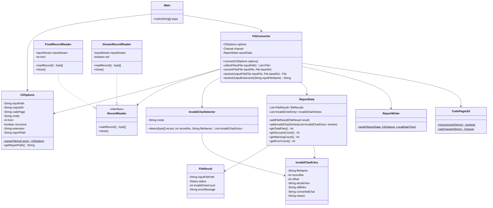

# クラス設計書 — E2UConverter

## 1. クラス一覧

| クラス名 | パッケージ | 種別 | 概要 |
|---|---|---|---|
| `Main` | `com.example.e2uconverter` | クラス | エントリーポイント |
| `CliOptions` | `com.example.e2uconverter.cli` | クラス | CLI 引数解析・保持 |
| `FileConverter` | `com.example.e2uconverter.converter` | クラス | 変換処理制御 |
| `RecordReader` | `com.example.e2uconverter.converter` | インターフェース | レコード読み込み抽象化 |
| `FixedRecordReader` | `com.example.e2uconverter.converter` | クラス | 固定長レコード読み込み |
| `StreamRecordReader` | `com.example.e2uconverter.converter` | クラス | バイトストリーム読み込み |
| `InvalidCharDetector` | `com.example.e2uconverter.validator` | クラス | 不正文字検知 |
| `ReportData` | `com.example.e2uconverter.report` | クラス | レポートデータ集積 |
| `FileResult` | `com.example.e2uconverter.report` | クラス | ファイル単位処理結果 |
| `InvalidCharEntry` | `com.example.e2uconverter.report` | クラス | 不正文字 1 件情報 |
| `ReportWriter` | `com.example.e2uconverter.report` | クラス | Markdown レポート出力 |
| `CodePageUtil` | `com.example.e2uconverter.util` | クラス | コードページ検証 |

---

## 2. 各クラス詳細

---

### 2-1. Main

**概要**: プログラムのエントリーポイント。

**メソッド**

| 修飾子 | 戻り値 | メソッド名 | 引数 | 説明 |
|---|---|---|---|---|
| `public static` | `void` | `main` | `String[] args` | 起動処理。CliOptions を生成し FileConverter を呼び出す。 |

**処理の流れ**

1. `CliOptions.parse(args)` で引数を解析する。
2. 解析エラー時は標準エラー出力にメッセージを出力して `System.exit(1)` する。
3. `FileConverter.convert(options)` を実行する。

---

### 2-2. CliOptions

**概要**: Apache Commons CLI を使用してコマンドライン引数を解析し、オプション値を保持する。

**フィールド**

| 修飾子 | 型 | フィールド名 | 説明 |
|---|---|---|---|
| `private` | `String` | `inputPath` | `-i` の値 |
| `private` | `String` | `outputDir` | `-o` の値 |
| `private` | `String` | `codePage` | `-c` の値（デフォルト: `IBM-930`） |
| `private` | `String` | `mode` | `-m` の値（デフォルト: `fixed`） |
| `private` | `int` | `lrecl` | `-l` の値（デフォルト: `80`） |
| `private` | `boolean` | `recursive` | `-r` フラグ（デフォルト: `false`） |
| `private` | `String` | `extension` | `-e` の値（デフォルト: `null`） |
| `private` | `String` | `reportPath` | `-R` の値（デフォルト: `null`） |

**メソッド**

| 修飾子 | 戻り値 | メソッド名 | 引数 | 説明 |
|---|---|---|---|---|
| `public static` | `CliOptions` | `parse` | `String[] args` | 引数を解析して `CliOptions` を返す。エラー時は `ParseException` をスロー。 |
| `public` | `String` | `getInputPath` | — | inputPath を返す。 |
| `public` | `String` | `getOutputDir` | — | outputDir を返す。 |
| `public` | `String` | `getCodePage` | — | codePage を返す。 |
| `public` | `String` | `getMode` | — | mode を返す。 |
| `public` | `int` | `getLrecl` | — | lrecl を返す。 |
| `public` | `boolean` | `isRecursive` | — | recursive を返す。 |
| `public` | `String` | `getExtension` | — | extension を返す。 |
| `public` | `String` | `getReportPath` | — | reportPath を返す。未指定時は `<outputDir>/report.md` を返す。 |
| `public static` | `void` | `printHelp` | — | 使用方法を標準出力に表示する。 |

---

### 2-3. FileConverter

**概要**: 変換処理全体を制御する。入力パスの走査、各ファイルの変換、レポートデータの集積を行う。

**フィールド**

| 修飾子 | 型 | フィールド名 | 説明 |
|---|---|---|---|
| `private` | `CliOptions` | `options` | 変換オプション |
| `private` | `Charset` | `charset` | 変換に使用する Charset |
| `private` | `ReportData` | `reportData` | レポートデータ集積用 |

**メソッド**

| 修飾子 | 戻り値 | メソッド名 | 引数 | 説明 |
|---|---|---|---|---|
| `public` | `void` | `convert` | `CliOptions options` | 変換処理のメインメソッド。入力パスを走査し各ファイルを変換する。 |
| `private` | `List<File>` | `collectFiles` | `File inputPath` | 入力パスを走査してファイルリストを収集する。 |
| `private` | `void` | `convertFile` | `File inputFile, File baseDir` | 単一ファイルを変換する。 |
| `private` | `File` | `resolveOutputFile` | `File inputFile, File baseDir` | 出力ファイルのパスを決定する。 |
| `private` | `String` | `resolveOutputExtension` | `String inputFileName` | 出力ファイルの拡張子を決定する。 |

---

### 2-4. RecordReader（インターフェース）

**概要**: ファイルをレコード単位に読み込む抽象インターフェース。`Closeable` を継承する。

**メソッド**

| 修飾子 | 戻り値 | メソッド名 | 引数 | 説明 |
|---|---|---|---|---|
| `public` | `byte[]` | `readRecord` | — | 次のレコードのバイト配列を返す。ファイル末尾に達した場合は `null` を返す。 |
| `public` | `void` | `close` | — | リソースを解放する（`Closeable` 由来）。 |

---

### 2-5. FixedRecordReader

**概要**: `RecordReader` の固定長レコードモード実装。ファイルを LRECL バイト単位に分割して読み込む。

**フィールド**

| 修飾子 | 型 | フィールド名 | 説明 |
|---|---|---|---|
| `private` | `InputStream` | `inputStream` | 入力ファイルのストリーム |
| `private` | `int` | `lrecl` | レコード長（バイト数） |

**コンストラクタ**

| 引数 | 説明 |
|---|---|
| `File file, int lrecl` | ファイルと LRECL を受け取る。 |

**メソッド**

| 修飾子 | 戻り値 | メソッド名 | 引数 | 説明 |
|---|---|---|---|---|
| `public` | `byte[]` | `readRecord` | — | LRECL バイト読み込む。不足した場合は実際に読めたバイト数分の配列を返す。`null` で EOF を示す。 |
| `public` | `void` | `close` | — | ストリームをクローズする。 |

---

### 2-6. StreamRecordReader

**概要**: `RecordReader` のバイトストリームモード実装。EBCDIC CR（`0x0D`）/NL（`0x15`）/NL25（`0x25`）を行区切りとして 1 行ずつ返す。

**フィールド**

| 修飾子 | 型 | フィールド名 | 説明 |
|---|---|---|---|
| `private` | `InputStream` | `inputStream` | 入力ファイルのストリーム |
| `private` | `boolean` | `eof` | EOF フラグ |

**コンストラクタ**

| 引数 | 説明 |
|---|---|
| `File file` | ファイルを受け取る。 |

**メソッド**

| 修飾子 | 戻り値 | メソッド名 | 引数 | 説明 |
|---|---|---|---|---|
| `public` | `byte[]` | `readRecord` | — | 行区切りコードまでのバイト配列を返す（区切りコード自身は含まない）。`null` で EOF を示す。 |
| `public` | `void` | `close` | — | ストリームをクローズする。 |

> **注意**: 行区切りコード（`0x0D`/`0x15`/`0x25`）は `readRecord()` が返す配列に含めず、呼び出し元が LF（`\n`）を付与する。

---

### 2-7. InvalidCharDetector

**概要**: 1 レコード（行）のバイト配列を受け取り、不正文字・制御文字・SO/SI 不正・コードページ未定義文字を検知する。

**フィールド**

| 修飾子 | 型 | フィールド名 | 説明 |
|---|---|---|---|
| `private` | `String` | `mode` | 入力モード（`fixed` / `stream`） |
| `private` | `Charset` | `charset` | 変換に使用する Charset |

**コンストラクタ**

| 引数 | 説明 |
|---|---|
| `String mode, Charset charset` | 入力モードと Charset を受け取る。 |

**メソッド**

| 修飾子 | 戻り値 | メソッド名 | 引数 | 説明 |
|---|---|---|---|---|
| `public` | `List<InvalidCharEntry>` | `detect` | `byte[] record, int recordNo, String fileName` | レコードを検査し、不正文字エントリのリストを返す。 |
| `private` | `boolean` | `isControlChar` | `int b` | 制御文字判定（モードに応じた範囲チェック）。 |
| `private` | `List<InvalidCharEntry>` | `validateSoSi` | `byte[] record, int recordNo, String fileName` | SO/SI ペアを検証する。 |
| `private` | `String[]` | `convertSingleByte` | `byte b` | 1 バイトを Charset で変換し `[utf8Hex, convertedChar]` を返す。変換不能時は `["-", "-"]`。 |

**不正文字判定範囲（固定長モード）**

| 範囲 | 理由 |
|---|---|
| `0x00`–`0x0D` | 制御文字 |
| `0x10`–`0x3F`（`0x0E`/`0x0F` 除く） | 制御文字・変換不能 |
| `0xFF` | 変換不能 |
| `0x40`–`0xFE`（DBCS 区間外で変換結果が `?`） | コードページ未定義文字 |

**不正文字判定範囲（バイトストリームモード）**

| 範囲 | 理由 |
|---|---|
| `0x00`–`0x0C` | 制御文字 |
| `0x10`–`0x14`（`0x0E`/`0x0F` 除く） | 制御文字・変換不能 |
| `0x16`–`0x24` | 制御文字・変換不能 |
| `0x26`–`0x3F`（`0x0E`/`0x0F` 除く） | 制御文字・変換不能 |
| `0xFF` | 変換不能 |
| `0x40`–`0xFE`（DBCS 区間外で変換結果が `?`） | コードページ未定義文字 |

---

### 2-8. ReportData

**概要**: 全変換処理の結果を集積する。スレッドセーフは不要（シングルスレッド前提）。

**フィールド**

| 修飾子 | 型 | フィールド名 | 説明 |
|---|---|---|---|
| `private` | `List<FileResult>` | `fileResults` | ファイル処理結果リスト |
| `private` | `List<InvalidCharEntry>` | `invalidCharEntries` | 不正文字詳細リスト（全ファイル分） |

**メソッド**

| 修飾子 | 戻り値 | メソッド名 | 引数 | 説明 |
|---|---|---|---|---|
| `public` | `void` | `addFileResult` | `FileResult result` | ファイル結果を追加する。 |
| `public` | `void` | `addInvalidCharEntries` | `List<InvalidCharEntry> entries` | 不正文字エントリリストを追加する。 |
| `public` | `int` | `getTotalFiles` | — | 処理ファイル総数を返す。 |
| `public` | `int` | `getSuccessCount` | — | 変換成功ファイル数を返す。 |
| `public` | `int` | `getWarningCount` | — | 不正文字検知ファイル数を返す。 |
| `public` | `int` | `getErrorCount` | — | エラーファイル数を返す。 |
| `public` | `int` | `getTotalInvalidCharCount` | — | 不正文字検知総件数を返す。 |
| `public` | `List<FileResult>` | `getFileResults` | — | ファイル結果リストを返す（不変ビュー）。 |
| `public` | `List<InvalidCharEntry>` | `getInvalidCharEntries` | — | 不正文字エントリリストを返す（不変ビュー）。 |

---

### 2-9. FileResult

**概要**: 単一ファイルの変換結果を保持するイミュータブルオブジェクト。

**フィールド**

| 修飾子 | 型 | フィールド名 | 説明 |
|---|---|---|---|
| `private final` | `String` | `inputFilePath` | 入力ファイルのパス |
| `private final` | `Status` | `status` | ステータス（`OK` / `WARNING` / `ERROR`） |
| `private final` | `int` | `invalidCharCount` | 不正文字検知件数 |
| `private final` | `String` | `errorMessage` | エラーメッセージ（エラー時のみ） |

**列挙型 `Status`**

| 値 | 意味 |
|---|---|
| `OK` | 不正文字なしで変換成功 |
| `WARNING` | 不正文字を検知したが変換完了 |
| `ERROR` | 処理失敗 |

**コンストラクタ**

| 引数 | 説明 |
|---|---|
| `String inputFilePath, Status status, int invalidCharCount, String errorMessage` | 各フィールドを受け取る。 |

**メソッド**

各フィールドの getter のみ提供（setter なし）。

---

### 2-10. InvalidCharEntry

**概要**: 不正文字 1 件の情報を保持するイミュータブルオブジェクト。

**フィールド**

| 修飾子 | 型 | フィールド名 | 説明 |
|---|---|---|---|
| `private final` | `String` | `fileName` | 入力ファイルのパス |
| `private final` | `int` | `recordNo` | 行番号（1 始まり） |
| `private final` | `int` | `offset` | 行頭からのオフセット（0 始まり） |
| `private final` | `String` | `ebcdicHex` | EBCDIC HEX 値（例: `0x1F`） |
| `private final` | `String` | `utf8Hex` | 変換後 UTF-8 HEX 値（変換不能時は `-`） |
| `private final` | `String` | `convertedChar` | 変換後文字（表示不能時は `-`） |
| `private final` | `String` | `reason` | 検知理由（`制御文字` / `SO/SI不正` / `変換不能` / `未定義文字`） |

**コンストラクタ**

| 引数 | 説明 |
|---|---|
| `String fileName, int recordNo, int offset, String ebcdicHex, String utf8Hex, String convertedChar, String reason` | 各フィールドを受け取る。 |

**メソッド**

各フィールドの getter のみ提供（setter なし）。

---

### 2-11. ReportWriter

**概要**: `ReportData` と `CliOptions` を受け取り、Markdown 形式のレポートファイルを生成する。

**メソッド**

| 修飾子 | 戻り値 | メソッド名 | 引数 | 説明 |
|---|---|---|---|---|
| `public static` | `void` | `write` | `ReportData data, CliOptions options, LocalDateTime startTime` | レポートファイルを生成する。 |
| `private static` | `String` | `buildSummarySection` | `CliOptions options, LocalDateTime startTime` | セクション1（実行サマリー）の Markdown テキストを生成する。 |
| `private static` | `String` | `buildStatisticsSection` | `ReportData data` | セクション2（処理統計）の Markdown テキストを生成する。 |
| `private static` | `String` | `buildFileListSection` | `ReportData data` | セクション3（処理ファイル一覧）の Markdown テキストを生成する。 |
| `private static` | `String` | `buildErrorListSection` | `ReportData data` | セクション4（エラーファイル一覧）の Markdown テキストを生成する。 |
| `private static` | `String` | `buildInvalidCharSection` | `ReportData data` | セクション5（不正文字検知詳細）の Markdown テキストを生成する。 |
| `private static` | `String` | `buildCodeTableSection` | `CliOptions options` | セクション6（SBCS コード変換対応表）の Markdown テキストを生成する。 |

---

### 2-12. CodePageUtil

**概要**: Java の `Charset` にコードページが存在するかを検証するユーティリティ。

**メソッド**

| 修飾子 | 戻り値 | メソッド名 | 引数 | 説明 |
|---|---|---|---|---|
| `public static` | `boolean` | `isSupported` | `String codePage` | 指定コードページが `Charset.forName()` で取得可能かを返す。 |
| `public static` | `Charset` | `getCharset` | `String codePage` | `Charset` を返す。サポートされていない場合は `IllegalArgumentException` をスロー。 |

---

## 3. クラス関係図

