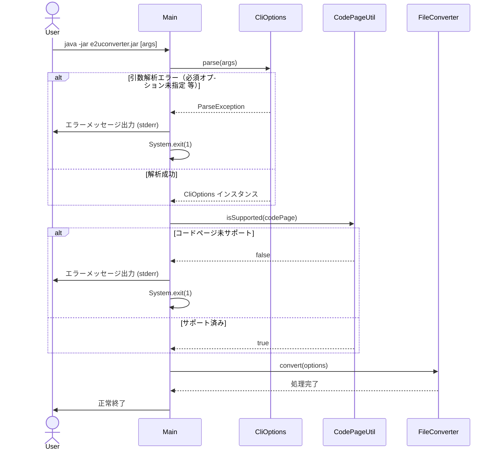
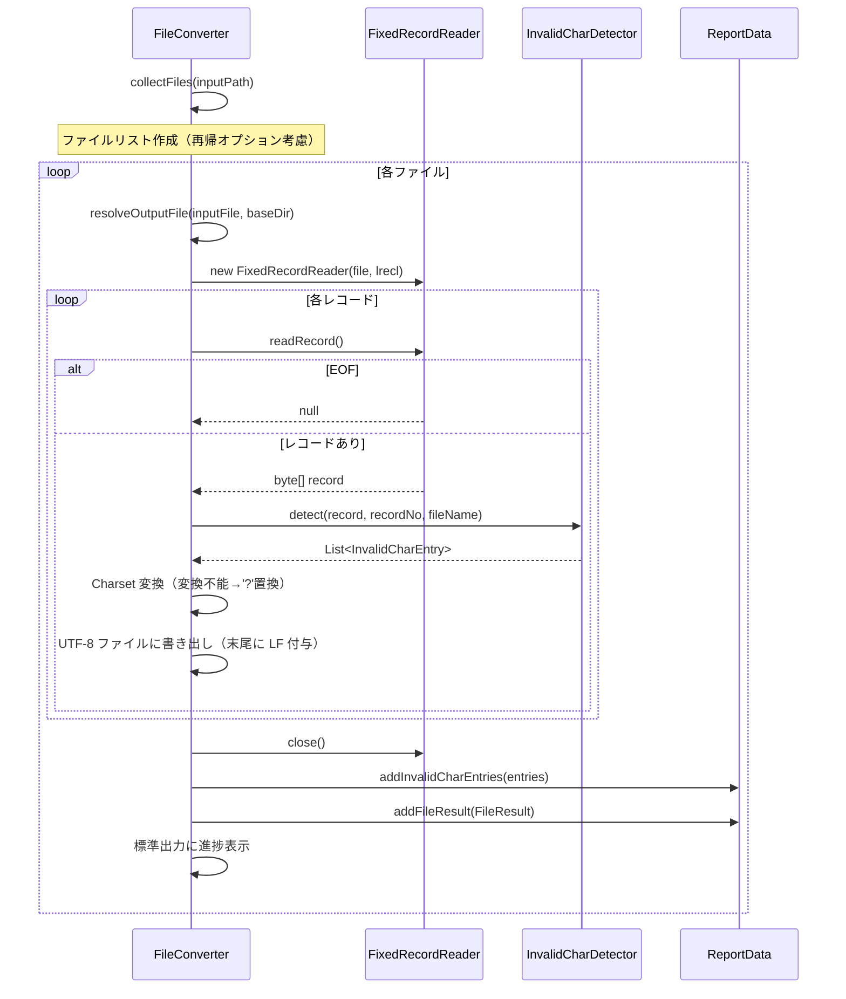
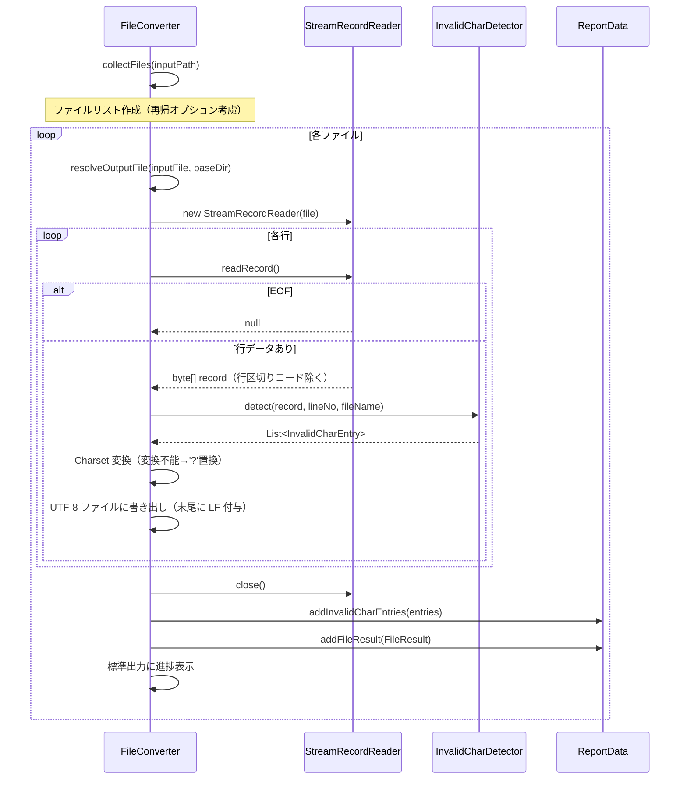
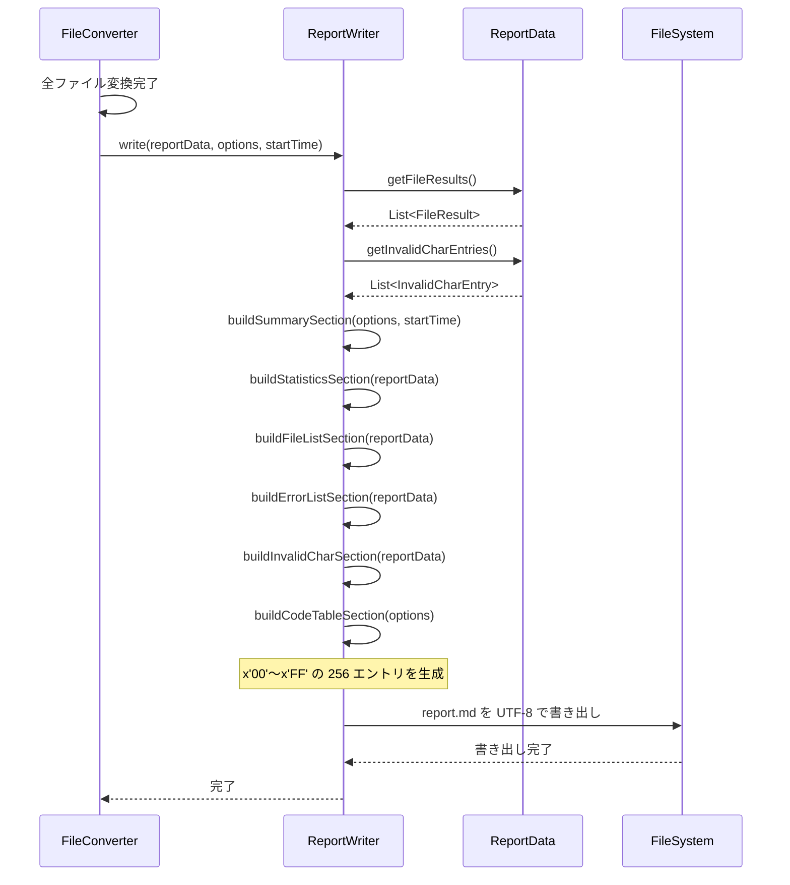
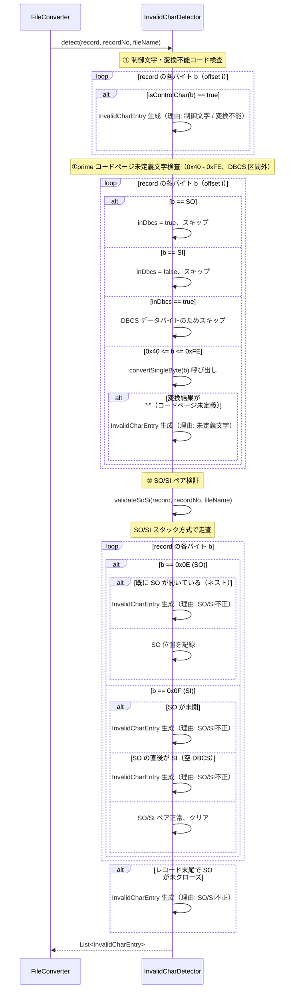
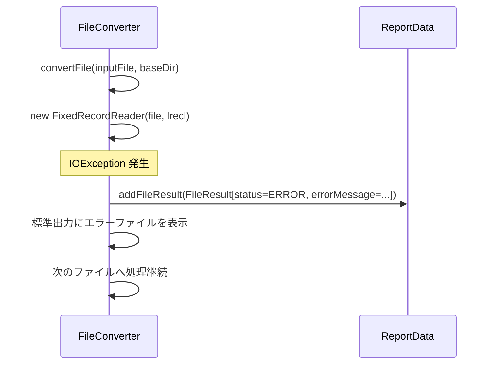
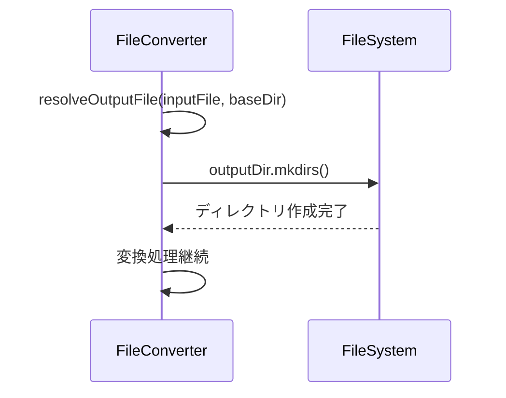

# シーケンス設計書 — E2UConverter

## 1. シーケンス図一覧

| No. | シーケンス名 | 概要 |
|---|---|---|
| SD-01 | 起動・引数解析シーケンス | プログラム起動から変換処理開始までの流れ |
| SD-02 | ファイル変換シーケンス（固定長モード） | 単一ファイルを固定長レコードで変換する流れ |
| SD-03 | ファイル変換シーケンス（バイトストリームモード） | 単一ファイルをバイトストリームで変換する流れ |
| SD-04 | レポート出力シーケンス | 全ファイル処理後にレポートを出力する流れ |
| SD-05 | 不正文字検知シーケンス | 1 レコードの不正文字検知の内部処理 |

---

## 2. SD-01: 起動・引数解析シーケンス

---

## 3. SD-02: ファイル変換シーケンス（固定長モード）

---

## 4. SD-03: ファイル変換シーケンス（バイトストリームモード）

---

## 5. SD-04: レポート出力シーケンス

---

## 6. SD-05: 不正文字検知シーケンス

---

## 7. エラー発生時のシーケンス

### 7-1. 個別ファイル読み込みエラー時

### 7-2. 出力先ディレクトリが存在しない場合

